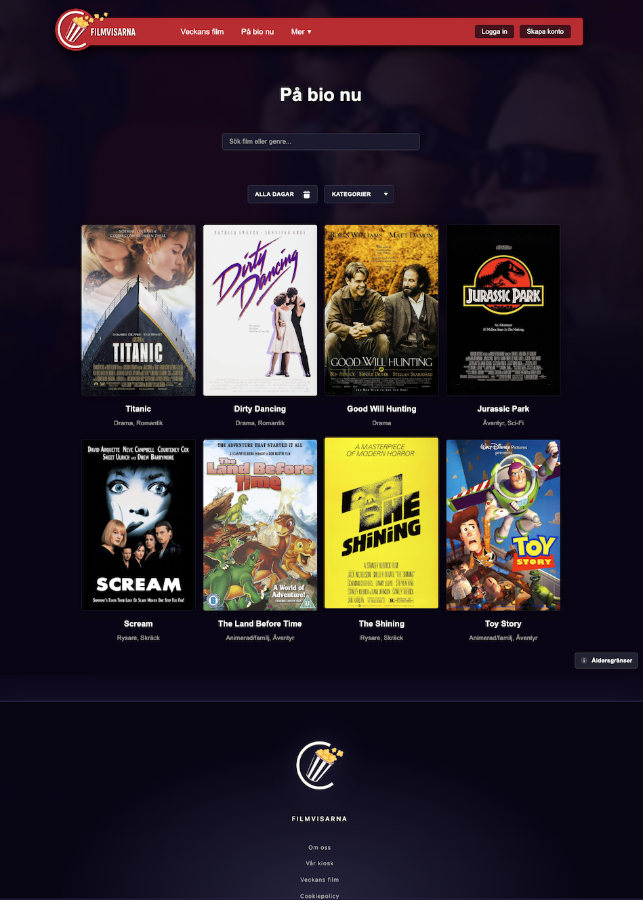

# Filmvisarna AB – Biografbokning

---

Filmvisarna AB är en biografkedja i Småstad som erbjuder en modern och användarvänlig webbplats där besökare enkelt kan utforska filmer och boka biljetter. Projektet är byggt med **React och TypeScript** för en snabb, tydlig och hållbar kodbas.

Projektet har utvecklats enligt agila arbetsmetoder med fokus på UX, responsiv design samt korrekt hantering av tekniska cookies enligt GDPR.



---

# Funktioner

#### Filmvisning och information

- Lista över aktuella filmer
- Detaljsidor med trailers, beskrivningar och visningstider
- Filtrering på datum och åldersgräns

#### Bokningssystem

- Grafisk visning av salongens stolar
- Realtidsuppdatering av tillgängliga platser
- Prislogik för olika biljettkategorier
- Totalprisberäkning
- Bokningsbekräftelse med unikt bokningsnummer
- E-postbekräftelse skickas automatiskt.
- Avbokning av framtida bokningar
- “Mina bokningar” med historik

#### Konto och användare

- Registrering, inloggning och hantering av bokningshistorik.
- LocalStorage för sessionshantering
- ProtectedRoute för skyddade sidor

#### Åldersgränser

- AgeLimitInfo-modal med tydlig information om åldersgränser

#### Cookies och GDPR

Filmvisarna använder endast nödvändig teknisk lagring för inloggning och funktioner.En cookie-banner informerar användaren och låter dem välja:

- “Acceptera alla”
- “Endast nödvändiga”

Samtycket sparas i LocalStorage (`cookieConsent`).

Projektet laddar inga statistik- eller marknadsföringscookies.

En CookiePolicy-sida beskriver Filmvisarnas hantering av cookies i klartext.

#### Responsiv design

- Utformad för desktop, mobil och surfplatta
- Anpassad layout på alla sidor

---

## Teknologier

#### Frontend

- React
- TypeScript
- React Router DOM
- CSS (egen, modulär struktur)
- LocalStorage (authentication + cookie consent)

#### Backend

- Node.js
- Express
- MySQL
- Nodemailer

---

## Installation

```
npm install
npm run dev
```

Backend körs separat.

---

## GDPR och Cookiepolicy – sammanfattning

- Endast tekniskt nödvändig data/localStorage används.
- Ingen spårning eller analys.
- Cookie-banner hanterar val för framtida funktionalitet.
- All hantering följer GDPR för tekniska cookies.

---

## Testning

- Manuell testning av bokningsflöde
- Test av login/register
- Test av cookie-banner
- Responsivitet på desktop + mobil

---

## Utvecklare

Detta projekt utvecklades av:

- **Daniel Arvebäck**
- **William Westergård**
- **Madelen Nilsen**
- **Julia Rasmusson**
- **Daniel Norén**

---

### Besök gärna våran sida

[https://filmvisarnaretro.nodehill.se]()

---
